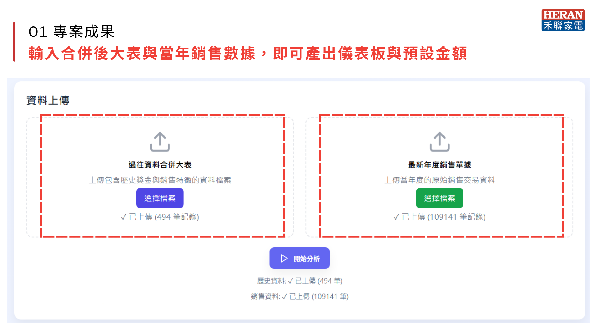
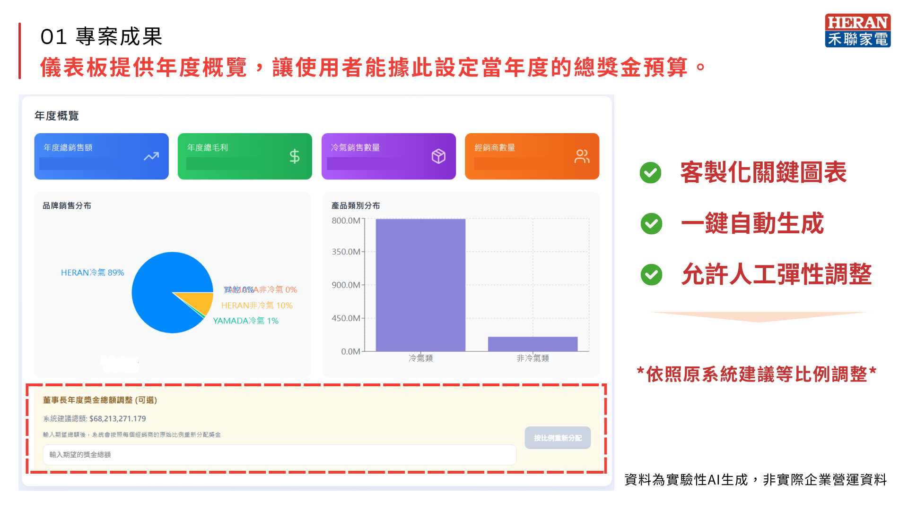
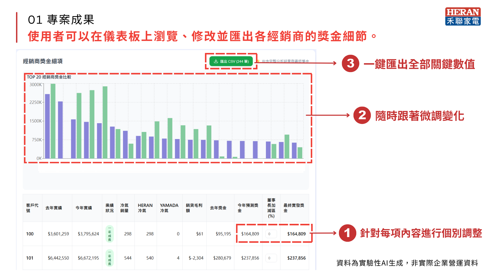
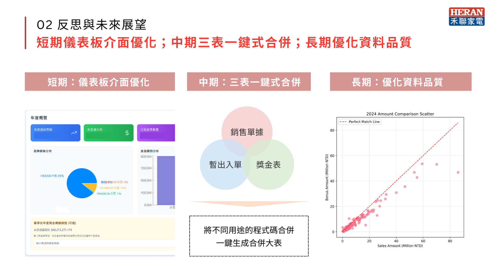

#  Bonus Prediction Dashboard

A React-based dashboard for bonus prediction and allocation.  
It supports CSV and Excel uploads, parses and visualizes data with **Recharts**, and enables clean data export.  
Built with **Recharts, PapaParse, XLSX, and Lucide**, this project demonstrates expertise in **front-end development, data parsing, and interactive visualization**.

---

##  Features
- Upload and parse **CSV/Excel** files
- **Interactive dashboard** with annual overview
- Dynamic bonus calculation and editing
- Export cleaned data to **CSV/Excel**
- Modern UI with **Lucide icons**

---

##  Tech Stack
- **React** – Front-end framework  
- **Recharts** – Data visualization  
- **PapaParse / XLSX** – Data parsing and file handling  
- **Lucide** – Icons for UI clarity  

---

##  Project Results

### 1. Dashboard Development
- **Input & Data Merge**  
  Input the merged master table and annual sales data to generate the dashboard and default bonus amount.  
  

- **Annual Overview & Bonus Budget**  
  The dashboard provides an annual overview, allowing users to set the total bonus budget for the year.  
  

- **Dealer Bonus Management**  
  Users can view, edit, and export detailed bonus allocations for each dealer.  
  

### 2. Reflection & Future Outlook
- **Short-term**: Interface optimization of the dashboard  
- **Mid-term**: One-click merge for three key tables  
- **Long-term**: Data quality improvement  
  

---
